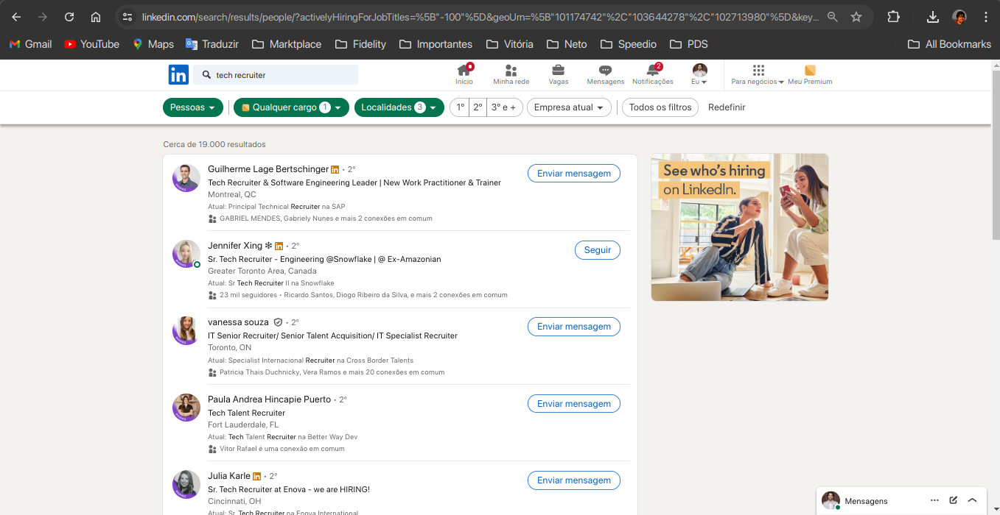

# Scriptzin

Scriptzin is a backend application built with Python, designed to handle specific tasks and operations efficiently. This repository contains the core code, configuration, and dependencies needed to run the application.

## Features

- Environment configuration using `.env` file
- Constants management
- Core application logic
- Dependency management with `requirements.txt`

## Getting Started

To get started with the project, follow these steps:

### Prerequisites

- Python 3.x
- Pip (Python package installer)

### Installation

1. **Clone the repository:**
   ```bash
   git clone https://github.com/yourusername/scriptzin.git
   cd scriptzin
   ```

2. **Create and activate a virtual environment:**
   ```bash
   python -m venv venv
   source venv/bin/activate   # On Windows: venv\Scripts\activate
   ```

3. **Install dependencies:**
    ```bash
   pip install -r requirements.txt
   ```

4. **Set up environment variables:**
    Copy the .env.example file to .env and configure the necessary environment variables.
    ```bash
   cp .env.example .env
   ```

### Usage
To run the application, use the following command:
   ```bash
   python main.py
   ```

## Change URL

You need to change the URL if you need new recruiter search filters.

**Exemple of linkedin_url:**
https://www.linkedin.com/search/results/people/?activelyHiringForJobTitles=%5B%22-100%22%5D&geoUrn=%5B%22101174742%22%2C%22103644278%22%2C%22102713980%22%5D&keywords=tech%20recruiter&origin=FACETED_SEARCH&sid=d!G



